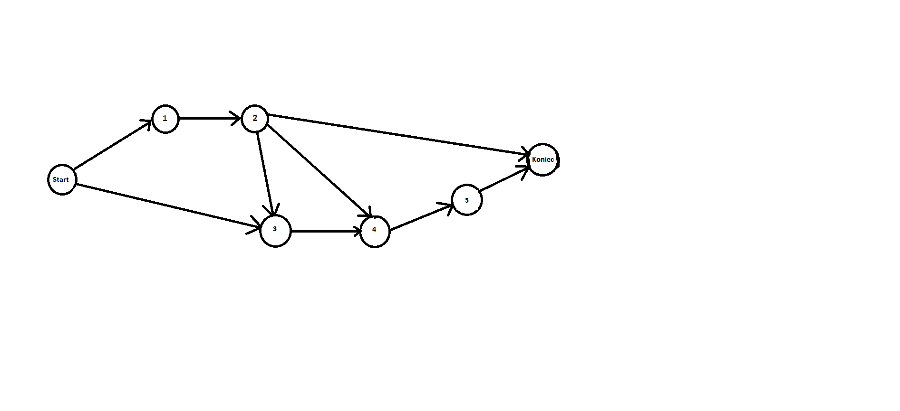

## 1. Technologia: Java (backend) i Swing (frontend)
## 2. Założenie jest aby zrobić tabelę z otrzymywanymi wynikami metody CPM
## 3. Następnie chcemy dodać graf który będzie wyglądał następująco:

## 4. Na grafie lub nad grafem mają się wyświetlać minimalne i maksymalne czasy wykonania zdarzenia.
## 5. Plan jest aby graf i tabel uaktualniały się jednocześnie po dodaniu danego zdarzenia lub czynności.
## 6. Założenie jest że zdarzenia i czynności będą dodawane z wyskakującego okna, które będzie pojawiało się po naciśnięciu odpowiedniego przycisku, będzie również opcja usunięcia zdarzenia i czynności.
## 7. Po wprowadzeniu wszystkich zdarzeń przy pomocy klawisza będzie można wyznaczyć ścieżkę krytyczną.
## 8. Będzie również opcja wyczyszczenia wszystkiego.
## 9. Nie planujemy dodawać Harmonogramu Gantta.
### Rozkład pracy:
Michał Macias i Ada Różańska (Backend), 
Szymon Pupka (Frontend)
